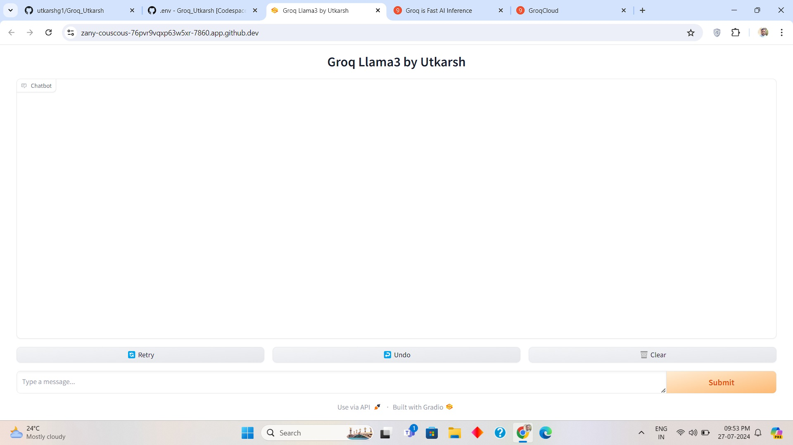
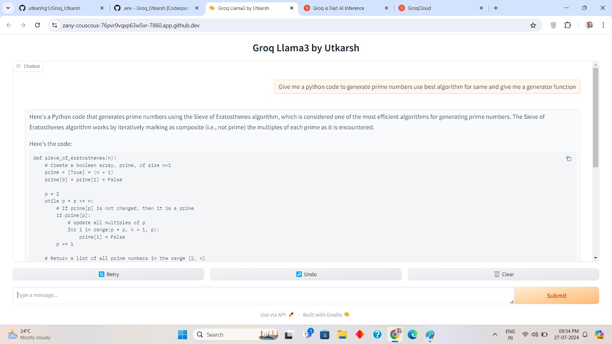

# Groq_Chat with LLama3 8B parameters faster inference with LPU

This is the Web App created by me Utkarsh Gaikwad. Which will give a chat 
interface to chat with LLama3 8b params with high infercence with Groq 
Its almost instant response.

## Getting Groq API Key its free

1. Create an account on groq website : [https://groq.com/](https://groq.com/)
2. Generate the api key from this link : [https://console.groq.com/keys](https://console.groq.com/keys)

## Clone this repo

~~~bash
git clone https://github.com/utkarshg1/Groq_Utkarsh.git .
~~~

## Creating virtual env and activating
~~~bash
python3 -m venv env
~~~

~~~bash
source env/bin/activate
~~~

## Installing the requirements

~~~bash
python3 -m pip install --upgrade pip
~~~

~~~bash
pip install -r requirements.txt
~~~

## Saving the .env file

create a file named .env in directory to save the file where you save api keys

filename - .env
~~~
GROQ_API_KEY = "<YOUR API KEY>"
~~~

# Running this webapp

This is a gradio webapp interface which can run with below command

This webapp will run on localhost port 7860

~~~bash
python3 app.py
~~~

app runs on : [http://127.0.0.1:7860](http://127.0.0.1:7860)

## App Interface

## Model response

